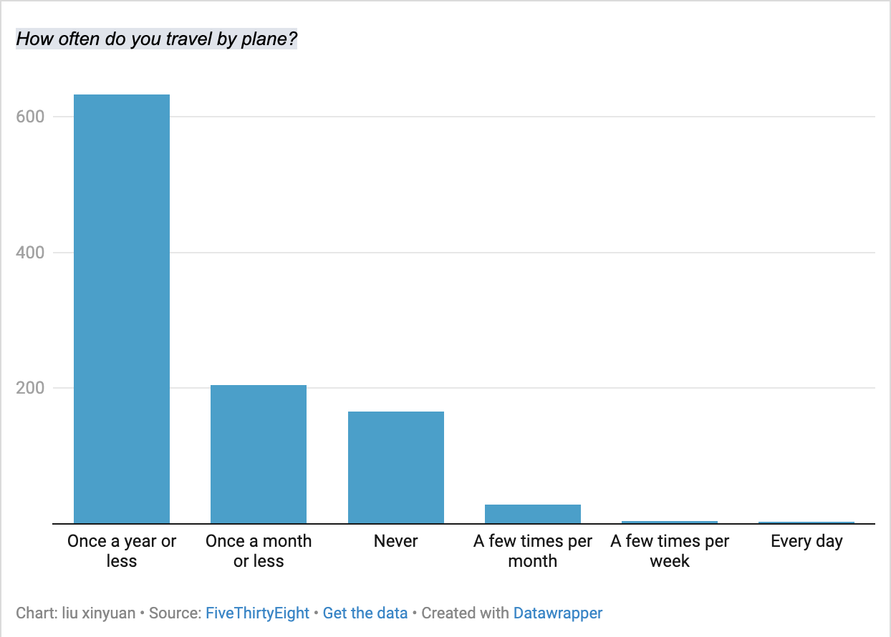

# J124 Week 4 Question 6
## this is the datawrapper chart 

_This chart examines the frequency of people traveling by plane._

I picked this question because it may appear that traveling by plane has become very frequent in daily life as we often see people post their traveling pictures on social media. 

The data shows that actually more than half of the people travel by plane once or less than once a year. It is less common than some people would expect. Another interesting thing it reveals is that 3 people travel by plane on a daily basis which seems unrealistic. 
